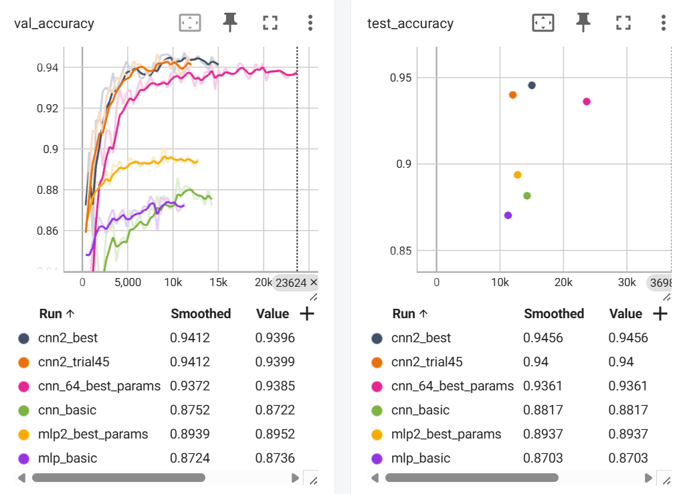

# Modular neural net hyperparameter optimization on Fashion-MNIST
Uses `Optuna`, `PyTorch`, and `Lightning`. Monitoring on `Tensorboard`.

Lightning will automatically detect and use all available GPUs.



Recreate python environment:
```bash
python -m venv .venv
source .venv/bin/activate
pip install -r requirements-lock.txt
```
## Project Structure
### `overview.ipynb`
This notebook goes through the optimization journey, from a basic fixed MLP, to an optimized one, to a basic and then optimized CNN.  
It shows the usage of the various modules below.

### `architectures.py`
defines the broad neural net `PyTorch` architectures:  
1. `MLPBasic`, a basic MLP with fixed number of layers and nodes. Used as a baseline.
2. `MLP`, a configurable MLP implementation, number of layers and nodes per layer are set by the user.
3. `CNNBasic`, a basic fixed CNN architecture with 3 convolutional layers. Used as a baseline for CNN, to compare with the MLP architecture and to improve on with optimization.
4. Several variations of a configurable CNN: `CNN`, a minimal configurable CNN;
`CNNBatchNorm` adds batch normilization;
`CNN2` also uses batch normalization, but does 2 convolution operations before each pooling, and doubles the number of filters after each pooling. 

### `lightning_definitions.py`
defines the main `LitModule` and the `FashionMNISTDataModule`, inherited from standard `lightning` classes.  
The `LitModule` encapsulates any of the neural net architectures above with logic for training, validating, logging, testing, including the optimizer setup... It inherits all the standard boilerplate from the `LightningModule`.  
The `FashionMNISTDataModule` handles all the standard procedures for downloading and preprocessing the `Fashion-MNIST` dataset, does the normalization and augmentation, wraps the dataset in dataloaders used throughout training, validating, and testing.

### `run_with_lightning.py`
contatins `train_and_test` that will train and test a model from a hyperparameter configuration.
Uses chekpointing and early stopping during training, saves the best model weights, loads them for testing.  
`load_and_test` will load a model from a given path to weights and test it (without re-training).  

Can also be run from the terminal.  
The full training, validation (if either are applicable), and testing is logged, logs kept in the `lightning_logs` directory. One can run `tensorboard --logdir lightning_logs` to start `tensorboard` and explore the full training dynamic, compare between runs, etc.

### `optumize.py`
does the hyperparameter optimization of the `LitModule` on the `FashionMNISTDataModule` using `Optuna`, saving results in a `.db` file (in the `optuna_databases` folder) that can be explored and visualized later to understand the importance and best values for the hyperparameters, whether another optimization is needed, etc. It saves the best hyperparameters found in a `.yaml` file.
By default uses Optuna's TPE (tree Parzen estimators) sampler and median pruner to efficiently explore the hyperparameter space.

### `optuna_study_exploration.ipynb`
showcases several standard Optuna commands one can use to explore and visialize optuna studies. Uses the databases from Optuna studies in this project as examples.

### `config.py`
Creates a .yaml hyperparameter configuration file in the `configs` directory. Easy to edit and experiment.

The .yaml file can be used by `run_with_lightning.py`.

### `dataset_exploration.ipynb`
checks the size and balance of the Fashion-MNIST dataset used for this project, also has sample images for visualization.
